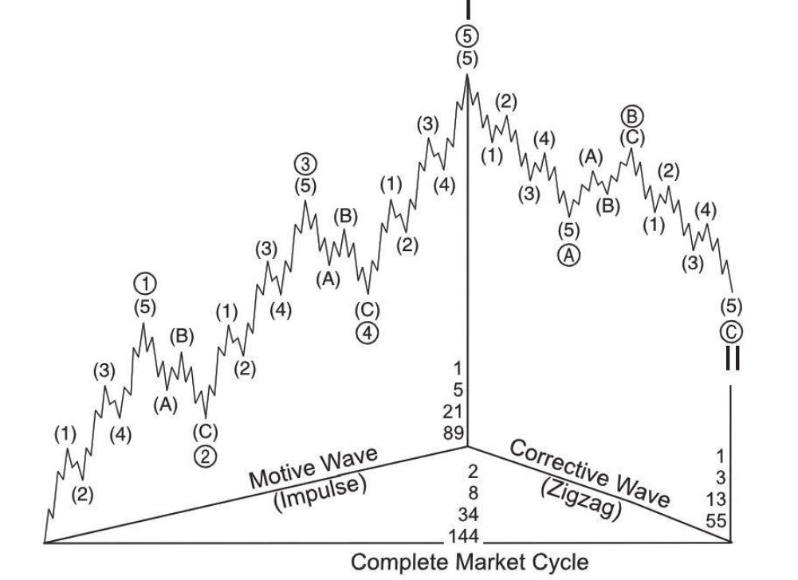
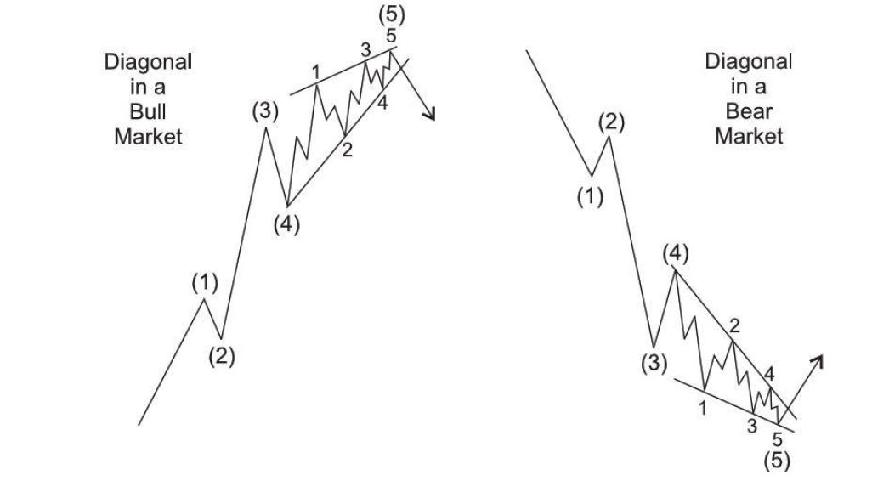

## Table of Contents 
- [MOTIVE WAVES](#motive-waves) 
	- [Impulse](#impulse)
	- [Diagonal](#diagonal)

-  [CORRECTIVE WAVES](#corrective-waves) 
	- [Zigzag](#zigzag)
	- [Flat](#flat)
	- [Contracting Triangle](#contracting-triangle)
	- [Barrier Triangle](#barrier-triangle)
	- [Expanding Triangle](#expanding-triangle)
	- [Combinations](#combinations)

# MOTIVE WAVES

## Impulse

### Rules

 - An impulse always subdivides into five waves. 
 - Wave 1 always subdivides into an impulse or (rarely) a diagonal. 
 - Wave 3 always subdivides into an impulse. 
 - Wave 5 always subdivides into an impulse or a diagonal. 
 - Wave 2 always subdivides into a zigzag, flat or combination. 
 - Wave 4 always subdivides into a zigzag, flat, triangle or combination.
 - Wave 2 never moves beyond the start of wave 1. 
 - Wave 3 always moves beyond the end of wave 1. 
 - Wave 3 is never the shortest wave. 
 - Wave 4 never moves beyond the end of wave 1. 
 - Never are waves 1, 3 and 5 all extended.

### Guidelines

 - Wave 4 will almost always be a different corrective pattern than wave 2. 
 -  Wave 2 is usually a zigzag or zigzag combination. 
 - Wave 4 is usually a flat, triangle or flat combination. 
 - Sometimes wave 5 does not move beyond the end of wave 3 (in which case it is called a
   truncation). 
 - Wave 5 often ends when meeting or slightly exceeding a line drawn from  
the end of wave 3 that is parallel to the line connecting the ends of waves 2 and 4, 
on either arithmetic or semilog scale. 
 - The center of wave 3 almost always has the steepest slope of any equal period within 
 the parent impulse, except that sometimes an early portion of wave 1 (the “kickoff”) will be steeper. 
- Wave 1, 3 or 5 is usually extended. (An extension appears “stretched” because
   its corrective waves are small compared to its impulse waves. It is
   substantially longer, and contains larger subdivisions, than the  non-extended waves). 
 - Often, the extended subwave is the same number (1,3 or 5) as the parent wave. 
  - Rarely do two subwaves extend, although it is typical for waves 3 and 5 both to extend when they are
   of Cycle or Supercycle degree and within a fifth wave of one degree higher. 
  - Wave 1 is the least commonly extended wave. 
  - When wave 3 is extended, waves 1 and 5 tend to have gains related by equality or
   the Fibonacci ratio. 
  - When wave 5 is extended, it is often in Fibonacci proportion to the net travel of waves 1 through 3. 
  - When wave 1 is extended, it is often in Fibonacci proportion to the net travel of waves 3 through 5.
  - Wave 4 typically ends when it is within the price range of subwave four of 3. 
  - Wave 4 often subdivides the entire impulse into Fibonacci proportion in time and/or price.

### Extended impulse

## Diagonal

### Ending diagonal

### Rules

 - A diagonal always subdivides into five waves.
 - An ending diagonal always appears as wave 5 of an impulse or wave C of a zigzag or flat.
- A leading diagonal always appears as wave1 of an impulse or wave A of a zigzag.
- Waves 1, 2, 3,4 and 5 of an ending diagonal, and waves 2 and 4 of a leading diagonal,
always subdivide into zigzags.
- Wave 2 never goes beyond the start of wave 1.
- Wave 3 always goes beyond the end of wave 1.
- Wave 4 never moves beyond the end of wave 2.
- A diagonal always subdivides into five waves.
- An ending diagonal always appears as wave 5 of an impulse or wave C of a zigzag or flat.
- A leading diagonal always appears as wave1 of an impulse or wave A of a zigzag.
- Waves 1, 2, 3, 4 and 5 of an ending diagonal, and waves 2 and 4 of a leading diagonal, 
always subdivide into zigzags.
- Wave 2 never goes beyond the start of wave 1.
- Wave 3 always goes beyond the end of wave 1.
- Wave4 never moves beyond the end of wave 2.

### Guidelines
- Waves 2 and 4 each usually retrace .66 to .81 of the preceding wave.
- Waves 1, 3 and 5 of a leading diagonal usually subdivide into zigzags  but sometimes 
appear to be impulses.
- Within an impulse, if wave 1 is a diagonal, wave* is likely to be extended.
- Within an impulse, wave 5 is unlikely to be a diagonal if wave 3 is not extended.
- In the contracting variety, wave 5 usually ends beyond the end of wave 3.
(Failure to do so is called a truncation.)
- In the contracting variety, wave 5 usually ends at or slightly beyond a line 
that connects the ends of waves 1 and 3. (Ending beyond that line is called a throw-over.)
- In the expanding variety, wave 5 usually ends slightly before reaching a line 
that connects the ends of waves 1 and 3.

# CORRECTIVE WAVES

## Zigzag
### Rules

 - A zigzag always subdivides into three waves.
 - Wave A always subdivides into an impulse or leading diagonal.
 - Wave C always subdivides into an impulse or diagonal.
 - Wave B always subdivides into a zigzag, flat, triangle or combination thereof.
 - Wave B never moves beyond the start of wave A.
### Guidelines
 - Wave A almost always subdivides into an impulse.
- Wave C almost always subdivides into an impulse.
- Wave C is often about the same length as wave A.
- Wave C almost always ends beyond the end of wave A.
- Wave B typically retraces 38 to 79 percent of wave A.
- If wave B is a running triangle, it will typically retrace between 10 and 40 percent of wave A.
- If wave B is a zigzag, it will typically retrace 50 to 79 percent of wave A.
- If wave B is a triangle, it will typically retrace 38 to 50 percent of wave A.
- A line connecting the ends of waves A and C is often parallel to a line connecting 
the end of wave B and the start of wave A.
- (Forecasting guideline: Wave C often ends upon reaching a line drawn from
the end of wave A that is parallel to a line connecting the start of wave A and the end of wave B.)
## Flat

### Rules

 - A flat always subdivides into three waves.
- Wave A is never a triangle.
- Wave C is always an impulse or a diagonal.
- Wave B always retraces at least 90 percent of wave A.
### Guidelines
- Wave B usually retraces between 100 and 138 percent of wave A.
- Wave C is usually between 100 and 165 percent as long as wave A.
- Wave C usually ends beyond the end of wave A.
### Notes
- Wave B usually retraces between 100 and 138 percent of wave A.
- Wave C is usually between 100 and 165 percent as long as wave A.
- Wave C usually ends beyond the end of wave A.

## Contracting Triangle
### Rules
- A triangle always subdivides into five waves.
- At least four waves among waves A, B, C, D and E each subdivide into a zigzag or zigzag combination.
- Wave C never moves beyond the end of wave A, wave D never moves beyond the end of wave B, 
and wave E never moves beyond the end of wave C. The result is that going forward in time, a line
connecting the ends of waves B and D converges with a line connecting the ends of waves A and C.
- A triangle never has more than one complex subwave, in which case it is always a zigzag combination or a triangle.
### Guidelines
- Usually, wave C subdivides into a zigzag combination that is longer lasting and contains deeper percentage retracements than each of the other subwaves.
- Sometimes, wave D subdivides into a zigzag combination that is longer lasting and contains deeper percentage retracements than each of the other subwaves.
- Sometimes one of the waves, usually wave C, D or E, subdivides into a contracting or barrier triangle. 
Often the effect is as if the entire triangle consisted of nine zigzags.
- About 60 percent of the time, wave B does not end beyond the start of wave A. When it does, the triangle is called a running triangle.
## Barrier Triangle
- A barrier triangle has the same characteristics as a contracting triangle, except that waves B and D end at essentially the same level. We have yet to observe a 9-wave barrier triangle, implying that this
form may not extend.
- When wave 5 follows a triangle, it is typically either a brief, rapid movement or an exceptionally long extension.
## Expanding Triangle
### Rules
Most rules are the same as for contracting triangles, with these differences:
- Wave C, D and E each moves beyond the end of the preceding same-directional subwave. 
(The result is that going forward in time, a line connecting the ends of waves B and D
 diverges from a line connecting the ends of waves A and C.)
- Subwaves B, C and D each retrace at least 100 percent but no more than 150 percent 
of the preceding subwave.
### Guidelines
Most guidelines are the same, with these differences:
- Subwaves B, C and D usually retrace 105 to 125 percent of the preceding subwave.
- No subwave has yet been observed to subdivide into a triangle.
## Combinations
### Rules
- Combinations comprise two (or three) corrective patterns separated by one (or two)
corrective pattern(s) in the opposite direction, labeled X. 
(The first corrective pattern is labeled W, the second Y, and the third, if there is one, Z.)
- A zigzag combination comprises two or three zigzags (in which case it is called a double 
- or triple zigzag).
- A “double three” flat combination comprises (in order) a zigzag and a flat, a flat and a zigzag,
a flat and a flat, a zigzag and a triangle or a flat and a triangle.
- A rare “triple three” flat combination comprises three flats.
- Double and triple zigzags take the place of zigzags, and double and triple threes take 
the place of flats and triangles.
- An expanding triangle has yet to be observed as a component of a combination.
### Guidelines
- When a zigzag or flat appears too small to be the entire wave with respect to the preceding wave 
(or, if it is to be wave 4,the preceding wave 2), a combination is likely.

